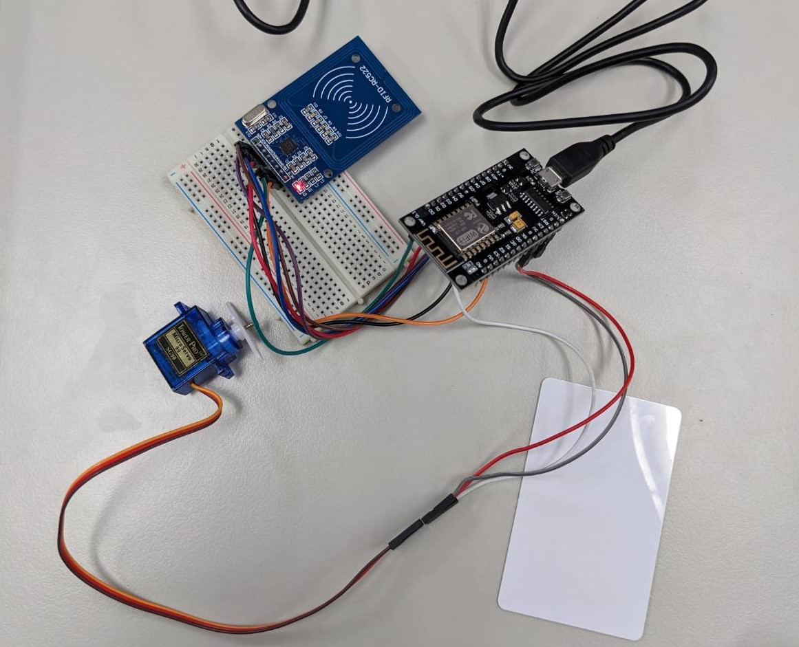

# Lock Server

This is a Python script that interacts with a MongoDB database and an ESP device to control access to a door based on RFID data. The ESP device is programmed using Arduino and the code is included in the `rfid_wifi.ino` file.

## Hardware
- esp8266 CH340
- RFID-RC522
- SG90
- wire
- breadbroad


## Dependencies

- Python 3
- pymongo
- requests
- python-dotenv
- Arduino IDE
- ESP8266WiFi library for Arduino
- WiFiClient library for Arduino
- ESP8266WebServer library for Arduino
- SPI library for Arduino
- MFRC522 library for Arduino
- Servo library for Arduino

## Environment Variables

The script uses the following environment variables:

- `mongo_db_password`: The password for the MongoDB database.

## How it works

The script continuously sends GET requests to the ESP device. The ESP device is expected to respond with RFID data.

The script then checks this RFID data against a MongoDB database to determine whether the RFID is associated with a user who has permission to open the door. If the user has permission, the door is opened.

## Database

The MongoDB database is hosted on MongoDB Atlas. The database is accessed using the pymongo library. The database contains a collection of users, each with a unique ID, permission level, description, and invalidation time.

## User Class

The User class is used to create user objects from the data retrieved from the MongoDB database. Each user object contains the following attributes:

- `uid`: The user's rfid unique ID.
- `id`: The user's ID.
- `permission`: The user's permission level.
- `description`: A description of the user.
- `invalid_time`: The time at which the user's access is invalidated.

## DB Class

The DB class is used to interact with the MongoDB database. It contains methods for adding users to the database.

## ESP Device

The ESP device is programmed using Arduino. It is set up to read RFID data and send this data as a response to GET requests. It also controls a servo motor that unlocks the door when a valid RFID is detected.


## Usage

To run the script, navigate to the directory containing the script and run the following command:

```bash
python lock_server.py
```